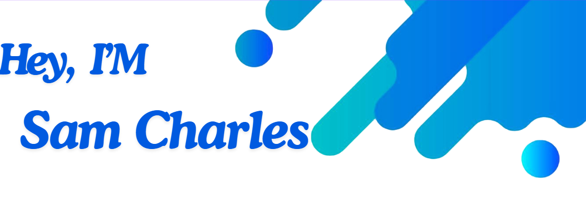
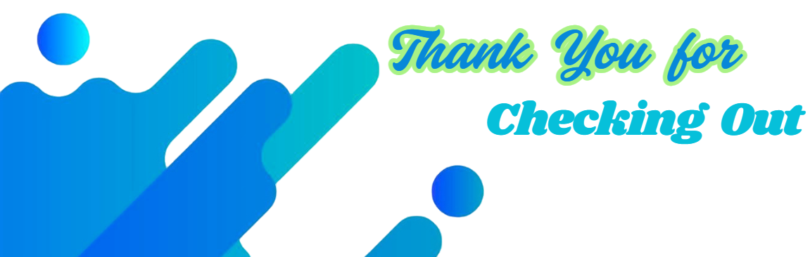

Bachelor's in **Computer Science Engineering (Honours)** from **Anna University**, batch [2021-2025], with a CGPA of **8.37**. Actively seeking opportunities as a **Software Development Engineer (SDE)** to contribute to innovative and impactful projects, while applying my knowledge and growing professionally in a dynamic environment.

<!-- ⚡ Fun fact: -->
- 👯 I’m looking to collaborate on projects that are using AI.
- 🌱 I’m currently working on AI Recruitment System using MERN Stack and Azure APIs.
- 🚵 I do Cycling on my free Time.
- 🍿 I love to Movies and Series.

*** Reach out to me ***

	
	
	
	

